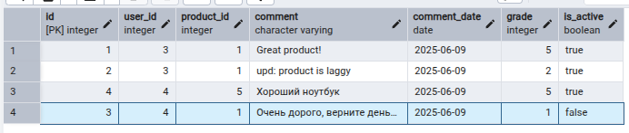

создадим модель в `models/reviews.py`:

```python
from sqlalchemy import Column, Integer, String, Date, Boolean, ForeignKey, func, CheckConstraint  
from sqlalchemy.orm import relationship  
from app.backend.db import Base  
  
class Review(Base):  
    __tablename__ = 'reviews'  
    __table_args__ = (  
        CheckConstraint('grade >= 1 AND grade <= 5', name='check_grade_range'),  
    )  
  
    id = Column(Integer, primary_key=True, index=True)  
    user_id = Column(Integer, ForeignKey('users.id'))  
    product_id = Column(Integer, ForeignKey('products.id'))  
    comment = Column(String, nullable=True)  
    comment_date = Column(Date, server_default=func.current_date())  
    grade = Column(Integer)  
    is_active = Column(Boolean, default=True)  
  
    user = relationship('User', back_populates='reviews')  
    product = relationship('Product', back_populates='reviews')
```

обратная связь в `models/user.py`:

```python
class User(Base):  
    __tablename__ = 'users'
	# ... остальные поля ...
	reviews = relationship('Review', back_populates='user')
```

обратная связь в `models/products.py`:

```python
class Product(Base):  
    __tablename__ = 'products'
	# ... остальные поля ...
	reviews = relationship('Review', back_populates='product')
```


в файле `migrations/env.py` добавим новую модель:

```python
# ...
from app.models import category, products, user, reviews # <- тут 
```

создаём и применим миграции: 

```shell
alembic revision --autogenerate -m "created reviews model"
alembic upgrade head
```

посмотрим на `ER`-диаграмму: 


---

создадим новую Pydantic-схему в файле `schemas.py`:

```python
class CreateReview(BaseModel):  
    comment: str | None = None  
    grade: Literal[1, 2, 3, 4, 5] = Field(default=5, description="Rate product from 1 to 5")  
  
    class Config:  
        json_schema_extra = {  
            "example": {  
                "comment": "Great product!",  
                "grade": 5,  
            }  
        }
```


весь код ендпоинтов в `routes/reviews.py`:

```python
from typing import Annotated  
  
from fastapi import APIRouter, Depends, status, HTTPException  
from sqlalchemy.orm import Session, selectinload  
from sqlalchemy.ext.asyncio import AsyncSession  
from sqlalchemy import insert, select, update, func  
  
  
from app.backend.db_depends import get_db  
from app.models.products import Product  
from app.models.reviews import Review
from app.schemas import CreateReview
  
from app.routers.auth import get_current_user  
  
router = APIRouter(prefix='/reviews', tags=['review'])  


async def update_product_rating(db: AsyncSession, product_id: int):  
    avg_grade = await db.scalar(  
        select(func.avg(Review.grade))  
        .where(Review.product_id == product_id)  
        .where(Review.is_active == True)  
    )  
  
    await db.execute(  
        update(Product)  
        .where(Product.id == product_id)  
        .values(rating=round(avg_grade or 0, 1))  
    )  
    await db.commit()  

  
@router.get('/')  
async def get_all_reviews(db: Annotated[AsyncSession, Depends(get_db)]):  
    reviews = await db.scalars(select(Review).where(Review.is_active == True))  
    return reviews.all()  
  

@router.post('/{product_slug}')  
async def add_review(db: Annotated[AsyncSession, Depends(get_db)], product_slug: str, create_review: CreateReview, current_user: Annotated[dict, Depends(get_current_user)]):  
  
    if not current_user.get('is_customer'):  
        raise HTTPException(403, detail="Only customers can leave reviews")  
  
    product = await db.scalar(  
        select(Product)  
        .where(Product.slug == product_slug)  
        .where(Product.is_active == True)  
    )  
    if not product:  
        raise HTTPException(404, detail="Product not found")  
  
    review = Review(  
        comment=create_review.comment,  
        grade=create_review.grade,  
        user_id=current_user['id'],  
        product_id=product.id  
    )  
    db.add(review)  
    await db.commit()  
    await update_product_rating(db, product.id)  
  
    return {  
        'status_code': status.HTTP_201_CREATED,  
        'transaction': 'Review was successfully added'  
    }  
  
  
@router.get('/{product_slug}')  
async def get_product_review(db: Annotated[AsyncSession, Depends(get_db)], product_slug: str, limit: int = 10):  
    product = await db.scalar(  
        select(Product)  
        .where(Product.slug == product_slug)  
        .where(Product.is_active == True)  
    )  
    if not product:  
        raise HTTPException(  
            status_code=status.HTTP_404_NOT_FOUND,  
            detail='Product not found'  
        )  
  
    reviews_result = await db.execute(  
        select(Review)  
        .options(selectinload(Review.user))
        .where(Review.product_id == product.id)  
        .where(Review.is_active == True)  
        .order_by(Review.comment_date.desc())  
        .limit(limit)  
    )  
    reviews = reviews_result.scalars().all()  
  
    return [  
        {  
            "id": review.id,  
            "comment": review.comment,  
            "grade": review.grade,  
            "comment_date": review.comment_date,  
            "user": {  
                "id": review.user.id,  
                "username": review.user.username  
            }  
        }  
        for review in reviews  
    ]  
  
  
@router.delete('/{review_id}')  
async def delete_review(db: Annotated[AsyncSession, Depends(get_db)], review_id: int, current_user: Annotated[dict, Depends(get_current_user)]):  
  
    if not current_user.get('is_admin'):  
        raise HTTPException(  
            status_code=status.HTTP_403_FORBIDDEN,  
            detail="Only admin can delete reviews"  
        )  
  
    review = await db.scalar(  
        select(Review)  
        .where(Review.id == review_id)  
        .where(Review.is_active == True)  
    )  
  
    if not review:  
        raise HTTPException(  
            status_code=status.HTTP_404_NOT_FOUND,  
            detail='Review not found'  
        )  
  
    review.is_active = False  
    await db.commit()  
    await update_product_rating(db, review.product_id)  
  
    return {  
        'status_code': status.HTTP_200_OK,  
        'transaction': 'Review was successfully deleted'  
    }
```

подключим их в `main.py`

```python
# ... остальной код ...
app.include_router(reviews.router)
```


тестируем через `http://127.0.0.1:8000/docs`.

будем работать со следующими двумя юзерами: 


по очереди логинимся за них и добавляем разные отзывы: 


При успешном запросе: 

```json
{
  "status_code": 201,
  "transaction": "Review was successfully added"
}
```

Сейчас у нас три оценки - 5, 2 и 1. Смотрим в БД среднюю оценку `2.7`: 


смотрим все отзывы через `/reviews`. ответ `200`, тело:

```json
[
  {
    "user_id": 3,
    "product_id": 1,
    "comment": "Great product!",
    "grade": 5,
    "is_active": true,
    "id": 1,
    "comment_date": "2025-06-09"
  },
  {
    "user_id": 3,
    "product_id": 1,
    "comment": "upd: product is laggy",
    "grade": 2,
    "is_active": true,
    "id": 2,
    "comment_date": "2025-06-09"
  },
  {
    "user_id": 4,
    "product_id": 1,
    "comment": "Очень дорого, верните деньги",
    "grade": 1,
    "is_active": true,
    "id": 3,
    "comment_date": "2025-06-09"
  },
  {
    "user_id": 4,
    "product_id": 5,
    "comment": "Хороший ноутбук",
    "grade": 5,
    "is_active": true,
    "id": 4,
    "comment_date": "2025-06-09"
  }
]
```

получаем отзывы только по конкретному товару `/reviews/{product_slug}`: 

```json
[
  {
    "id": 1,
    "comment": "Great product!",
    "grade": 5,
    "comment_date": "2025-06-09",
    "user": {
      "id": 3,
      "username": "ivanich"
    }
  },
  {
    "id": 2,
    "comment": "upd: product is laggy",
    "grade": 2,
    "comment_date": "2025-06-09",
    "user": {
      "id": 3,
      "username": "ivanich"
    }
  },
  {
    "id": 3,
    "comment": "Очень дорого, верните деньги",
    "grade": 1,
    "comment_date": "2025-06-09",
    "user": {
      "id": 4,
      "username": "petrovich"
    }
  }
]
```

если отзывов нет, вовзращает пустой список: 

```json
[]
```


пробуем удалить покупателем отзыв: 

```json
{
  "detail": "Only admin can delete reviews"
}
```

заходим за админа и удаляем: 

```json
{
  "status_code": 200,
  "transaction": "Review was successfully deleted"
}
```

ещё раз посмотрим на удалённый отзыв через БД: 



после удаленения негативного отзыва, общая средняя оценка повысилась: 


